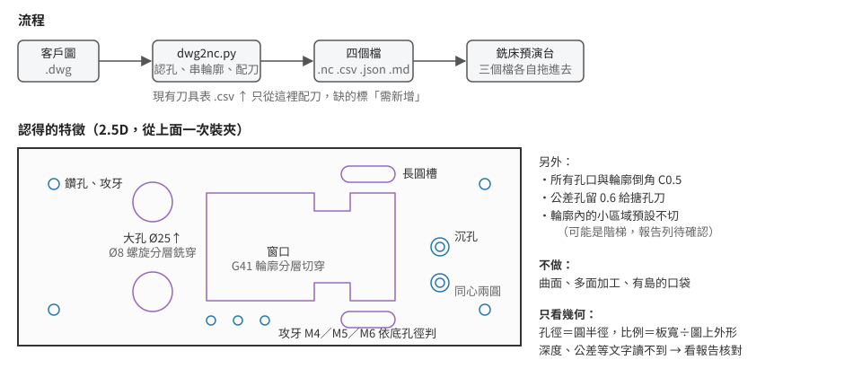

# dwg2nc

板件 DWG → Fanuc NC 程式 + 刀具表 + 素材檔。命令列工具，圖檔不離開電腦。



## 安裝

```bash
pip install ezdwg          # 讀 DWG（MIT）
pip install matplotlib     # 選用，畫路徑圖
```

## 用法

```bash
python tools/dwg2nc/dwg2nc.py 圖.dwg --plate 900x330x15 --tools 刀具表.csv
```

| 參數 | 說明 |
|---|---|
| `--plate 寬x高x厚` | 板的實際尺寸 mm，必填 |
| `--tools CSV` | 現有刀具表（預演台匯出的格式）。缺的刀標「需新增」 |
| `--onum` `--name` | O 號、程式名稱 |
| `--origin LB\|RB\|LT\|RT` | 原點放哪個角，預設左下，Z0 在上表面 |
| `--subfaces thru` | 輪廓內的小區域一起切穿（預設不切、列待確認） |
| `--skin 0.3` | 窗口最後一刀留皮 |
| `--region x0,y0,x1,y1` | 自動找錯視圖時手動指定 |
| `--out 資料夾` | 預設 DWG 旁的 `out/` |

## 輸出

| 檔案 | |
|---|---|
| `O2001.nc` | 程式 |
| `O2001_tools.csv` | 刀具表，拖進預演台匯入 |
| `O2001.stock.json` | 素材，拖進預演台套用 |
| `O2001_report.md` | 假設與待確認事項，**上機前先讀** |

## 驗證

```bash
node tools/dwg2nc/verify_nc.mjs   out/O2001     # 預演台 37 條檢查 + 模擬
python tools/dwg2nc/plot_paths.py out/O2001     # 產生 O2001_paths.png
```
